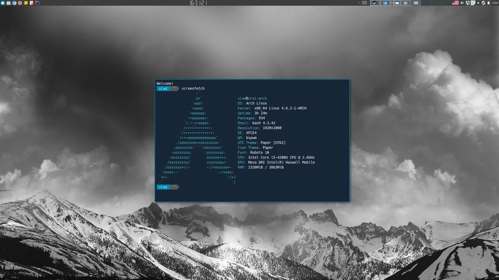
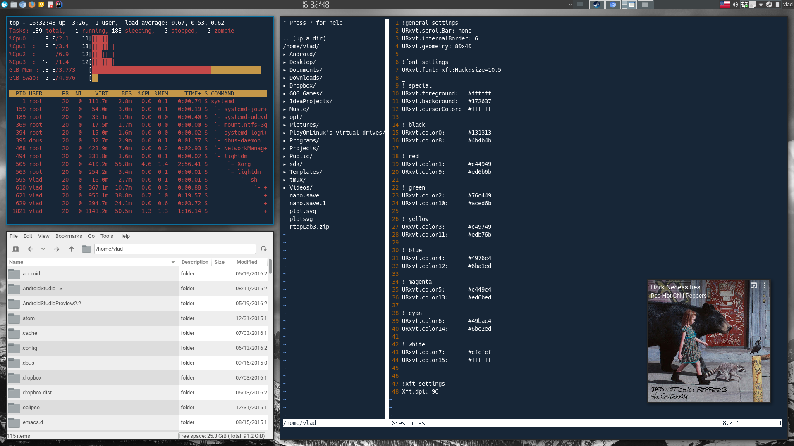
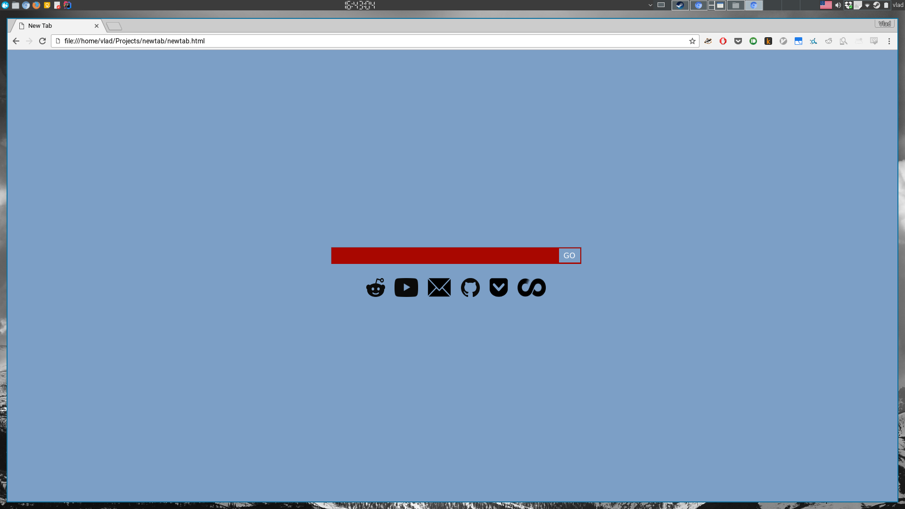
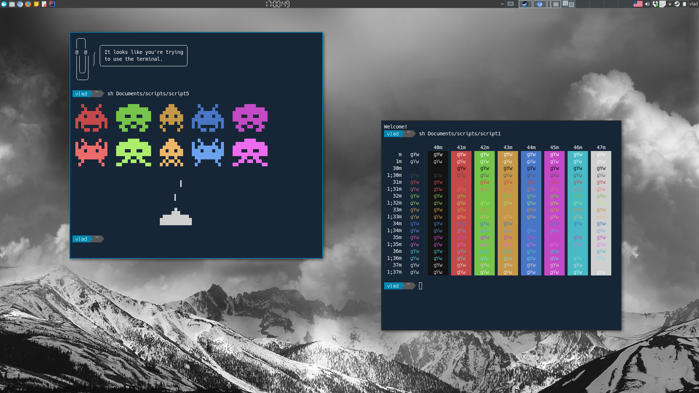

# dotfiles

I use XFCE BSPWM combo.

* file manager - PCManFM
* custom new tab page using chrome extension(https://tinyurl.com/hcxfwqd) - https://github.com/VladMyh/newtab
* GTK window/icon theme - Paper
* Shell prompt using powerline font - https://github.com/powerline/fonts
* wallpaper - http://i.imgur.com/zyGx2q7.jpg

# Screenshots

